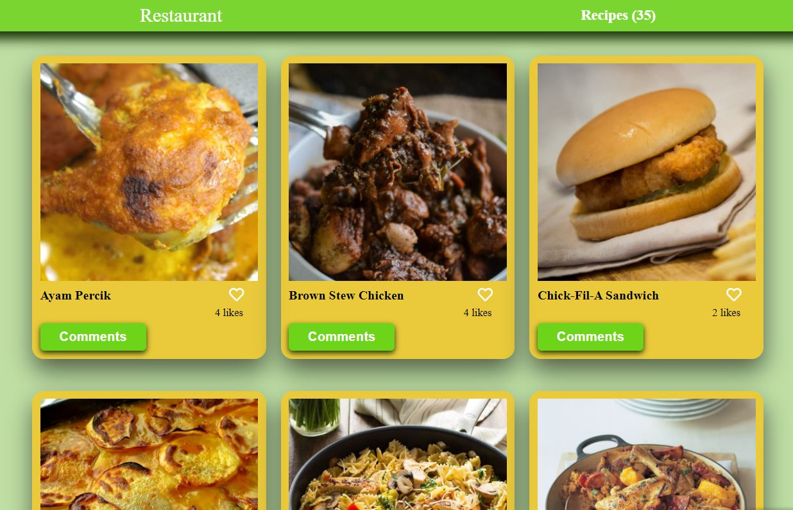
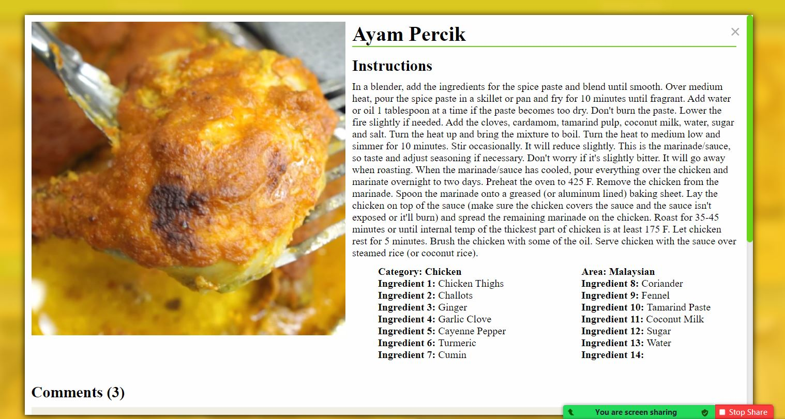

# JS Group Capstone

> This is the final project of JAVASCRIPT AND NETWORKING module assign by Microverse. It is a peer-prgramming prject, which is completed by two microverse student.

## Introduction

In this project we used two API's 1- MealsDB and 2- Involvement API

- MealsDB for fetching all Item's (recipes) inluding all details.
- Involvement API for saving and retriving Comments and likes count.

Below you can see how this website should look and behave:




## Live Demo

[Live Demo](https://sediqullahbadakhsh.github.io/js-group-capstone/)

## Preseting Feature Video

[Features Presentation](https://drive.google.com/file/d/11CaPd226ZlX6iafPMquDxX8QT1esD9md/view?usp=sharing)

## Setup

### Clone this repository

```bash
$ git clone git@github.com:sediqullahbadakhsh/js-group-capstone.git
$ cd JS-group-capstone
```

### Run project

```bash
$ npm install
$ npm run start # this will make webpack watching for your changes in code
```

### Open page in browser

```bash
$ open dist/index.html
```

## Built With

- HTML
- JavaScript
- CSS
- webpack
- Using APIs
- Jest

## Authors

👤 **Sediqullah Badakhsh**
👤 **Nizamuddin Ahmadzai**

## 🤝 Contributing

Contributions, issues, and feature requests are welcome!

Feel free to check the [issues page](https://github.com/sediqullahbadakhsh/js-group-capstone/issues).

## Show your support

Give a ⭐️ if you like this project!
